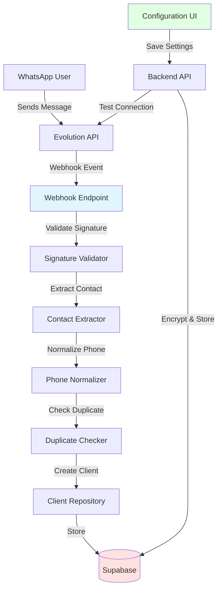

# Design Document: WhatsApp Auto-Import

## Overview

This feature extends the existing Google Review WhatsApp System by integrating Evolution API to automatically capture and register clients from incoming WhatsApp messages. The system will receive webhook events from Evolution API, extract contact information, and create client records in the database without manual intervention.

The design maintains complete backward compatibility with existing manual registration workflows while adding a new automated path for client acquisition. The architecture follows the existing Express/Supabase stack and integrates seamlessly with the current authentication and business logic layers.

## Architecture

### High-Level Architecture



### Component Interaction Flow

1. **Webhook Reception**: Evolution API sends POST request to `/api/webhooks/evolution` when a message is received
2. **Signature Validation**: System validates HMAC-SHA256 signature to ensure request authenticity
3. **Contact Extraction**: System extracts phone number and contact name from webhook payload
4. **Phone Normalization**: System converts phone to E.164 format for consistent storage
5. **Duplicate Check**: System queries database to check if phone already exists
6. **Client Creation**: If new, system creates client record with `import_source: "auto-imported"`
7. **Response**: System returns HTTP 200 to acknowledge webhook processing

### Integration Points

- **Evolution API**: External service providing WhatsApp connectivity
- **Existing Client Model**: Extended to support import source tracking
- **Supabase Database**: New table for Evolution API configuration, extended clients table
- **Authentication Middleware**: Reused for configuration endpoints
- **Frontend Configuration Page**: New UI for Evolution API settings

## Components and Interfaces

### 1. Webhook Endpoint (`/api/webhooks/evolution`)

**Purpose**: Receive and process Evolution API webhook events

**HTTP Interface**:
```typescript
POST /api/webhooks/evolution
Headers:
  - x-evolution-signature: string (HMAC-SHA256 signature)
Body: EvolutionWebhookPayload

Response:
  - 200: { success: true, clientId?: string }
  - 401: { error: "INVALID_SIGNATURE" }
  - 500: { error: "PROCESSING_ERROR", message: string }
```

**Payload Structure**:
```typescript
interface EvolutionWebhookPayload {
  event: string;              // "messages.upsert"
  instance: string;           // Instance name
  data: {
    key: {
      remoteJid: string;      // Phone number with @s.whatsapp.net
      fromMe: boolean;
      id: string;
    };
    pushName?: string;        // Contact name
    message: object;          // Message content (not stored)
  };
}
```

**Processing Logic**:
1. Extract signature from `x-evolution-signature` header
2. Validate signature using stored webhook secret
3. Check if event type is `messages.upsert` and `fromMe` is false
4. Extract phone from `remoteJid` (remove @s.whatsapp.net suffix)
5. Extract name from `pushName` or use phone as fallback
6. Normalize phone to E.164 format
7. Check for duplicate using normalized phone
8. Create client if new, skip if duplicate
9. Log result and return response

### 2. Evolution API Configuration Service

**Purpose**: Manage Evolution API credentials and connection testing

**Interface**:
```typescript
interface EvolutionConfig {
  id: string;
  userId: string;
  apiUrl: string;
  encryptedApiKey: string;
  instanceName: string;
  webhookSecret: string;
  isEnabled: boolean;
  createdAt: string;
  updatedAt: string;
}

class EvolutionConfigService {
  async getConfig(userId: string): Promise<EvolutionConfig | null>
  async saveConfig(userId: string, config: EvolutionConfigInput): Promise<EvolutionConfig>
  async testConnection(config: EvolutionConfigInput): Promise<boolean>
  async toggleEnabled(userId: string, enabled: boolean): Promise<void>
}
```

**Configuration Input**:
```typescript
interface EvolutionConfigInput {
  apiUrl: string;
  apiKey: string;           // Plain text (encrypted before storage)
  instanceName: string;
  webhookSecret: string;
}
```

**Connection Test**:
- Makes GET request to `{apiUrl}/instance/connectionState/{instanceName}`
- Includes `apikey: {apiKey}` header
- Returns true if response status is 200 and state is "open"

### 3. Signature Validator

**Purpose**: Validate webhook authenticity using HMAC-SHA256

**Interface**:
```typescript
class SignatureValidator {
  validate(payload: string, signature: string, secret: string): boolean
}
```

**Implementation**:
```typescript
import crypto from 'crypto';

function validateSignature(payload: string, signature: string, secret: string): boolean {
  const hmac = crypto.createHmac('sha256', secret);
  hmac.update(payload);
  const expectedSignature = hmac.digest('hex');
  
  // Constant-time comparison to prevent timing attacks
  return crypto.timingSafeEqual(
    Buffer.from(signature),
    Buffer.from(expectedSignature)
  );
}
```

### 4. Contact Extractor

**Purpose**: Extract contact information from webhook payload

**Interface**:
```typescript
interface ExtractedContact {
  phone: string;
  name: string;
}

class ContactExtractor {
  extract(payload: EvolutionWebhookPayload): ExtractedContact | null
}
```

**Extraction Logic**:
```typescript
function extractContact(payload: EvolutionWebhookPayload): ExtractedContact | null {
  // Only process incoming messages
  if (payload.data.key.fromMe) {
    return null;
  }
  
  // Extract phone (remove @s.whatsapp.net suffix)
  const remoteJid = payload.data.key.remoteJid;
  const phone = remoteJid.replace('@s.whatsapp.net', '');
  
  // Extract name (use phone as fallback)
  const name = payload.data.pushName || phone;
  
  return { phone, name };
}
```

### 5. Phone Normalizer

**Purpose**: Convert phone numbers to E.164 format for consistent storage

**Interface**:
```typescript
class PhoneNormalizer {
  normalize(phone: string): string
}
```

**Normalization Rules**:
- Remove all non-digit characters (spaces, dashes, parentheses)
- Ensure phone starts with country code
- If no country code detected, assume Brazil (+55)
- Format: `+{countryCode}{number}`

**Implementation**:
```typescript
function normalizePhone(phone: string): string {
  // Remove all non-digits
  const digits = phone.replace(/\D/g, '');
  
  // If starts with country code (more than 10 digits), add +
  if (digits.length > 10) {
    return `+${digits}`;
  }
  
  // Assume Brazil (+55) for 10-11 digit numbers
  return `+55${digits}`;
}
```

### 6. Duplicate Checker

**Purpose**: Check if phone number already exists in database

**Interface**:
```typescript
class DuplicateChecker {
  async exists(userId: string, phone: string): Promise<boolean>
}
```

**Implementation**:
- Query `clients` table for matching `user_id` and `phone`
- Use normalized phone for comparison
- Return true if any record found, false otherwise

### 7. Auto-Import Client Creator

**Purpose**: Create client records from auto-imported contacts

**Interface**:
```typescript
interface AutoImportClientInput {
  userId: string;
  phone: string;
  name: string;
}

class AutoImportClientCreator {
  async create(input: AutoImportClientInput): Promise<Client>
}
```

**Client Creation Logic**:
```typescript
async function createAutoImportedClient(input: AutoImportClientInput): Promise<Client> {
  return await supabase
    .from('clients')
    .insert({
      user_id: input.userId,
      phone: input.phone,
      name: input.name,
      satisfied: false,           // Default: unknown satisfaction
      complained: false,          // Default: no complaint
      review_status: 'NOT_SENT',  // Ready to receive review request
      import_source: 'auto-imported',
      attendance_date: new Date().toISOString(),
      created_at: new Date().toISOString()
    })
    .select()
    .single();
}
```

### 8. Configuration API Endpoints

**Purpose**: Manage Evolution API settings from frontend

**Endpoints**:

```typescript
// GET /api/evolution/config
// Returns current Evolution API configuration (API key masked)
router.get('/config', authMiddleware, async (req, res) => {
  const config = await evolutionConfigService.getConfig(req.user.userId);
  
  if (!config) {
    return res.json({ configured: false });
  }
  
  // Mask API key for security
  res.json({
    configured: true,
    apiUrl: config.apiUrl,
    apiKey: '***' + config.encryptedApiKey.slice(-4),
    instanceName: config.instanceName,
    isEnabled: config.isEnabled
  });
});

// POST /api/evolution/config
// Save Evolution API configuration
router.post('/config', authMiddleware, async (req, res) => {
  const { apiUrl, apiKey, instanceName, webhookSecret } = req.body;
  
  // Validate required fields
  if (!apiUrl || !apiKey || !instanceName || !webhookSecret) {
    return res.status(400).json({ error: 'Missing required fields' });
  }
  
  const config = await evolutionConfigService.saveConfig(req.user.userId, {
    apiUrl,
    apiKey,
    instanceName,
    webhookSecret
  });
  
  res.json({ success: true, config });
});

// POST /api/evolution/test-connection
// Test Evolution API connection
router.post('/test-connection', authMiddleware, async (req, res) => {
  const { apiUrl, apiKey, instanceName } = req.body;
  
  const isConnected = await evolutionConfigService.testConnection({
    apiUrl,
    apiKey,
    instanceName,
    webhookSecret: '' // Not needed for connection test
  });
  
  res.json({ connected: isConnected });
});

// POST /api/evolution/toggle
// Enable/disable auto-import
router.post('/toggle', authMiddleware, async (req, res) => {
  const { enabled } = req.body;
  
  await evolutionConfigService.toggleEnabled(req.user.userId, enabled);
  
  res.json({ success: true, enabled });
});
```

### 9. Health Check Endpoint

**Purpose**: Monitor Evolution API connectivity

**Endpoint**:
```typescript
// GET /api/health/evolution
router.get('/health/evolution', authMiddleware, async (req, res) => {
  const config = await evolutionConfigService.getConfig(req.user.userId);
  
  if (!config) {
    return res.status(503).json({
      status: 'not_configured',
      message: 'Evolution API not configured'
    });
  }
  
  const isConnected = await evolutionConfigService.testConnection(config);
  
  if (!isConnected) {
    return res.status(503).json({
      status: 'disconnected',
      message: 'Evolution API connection failed'
    });
  }
  
  res.json({
    status: 'connected',
    instance: config.instanceName
  });
});
```

### 10. Frontend Configuration Component

**Purpose**: UI for managing Evolution API settings

**Component Structure**:
```typescript
interface EvolutionConfigPageProps {}

interface EvolutionConfigState {
  apiUrl: string;
  apiKey: string;
  instanceName: string;
  webhookSecret: string;
  isEnabled: boolean;
  isLoading: boolean;
  isTesting: boolean;
  testResult: 'success' | 'error' | null;
}

const EvolutionConfigPage: React.FC = () => {
  // State management
  // Load existing config on mount
  // Handle form submission
  // Handle connection test
  // Handle enable/disable toggle
}
```

**UI Elements**:
- Text input: API URL (e.g., https://evolution-api.example.com)
- Password input: API Key (masked)
- Text input: Instance Name
- Password input: Webhook Secret
- Button: Test Connection (shows loading spinner)
- Toggle: Enable Auto-Import
- Button: Save Configuration

**Validation**:
- API URL must be valid HTTPS URL
- All fields required before saving
- Test connection before enabling auto-import

## Data Models

### Extended Clients Table

```sql
-- Add new column to existing clients table
ALTER TABLE clients
ADD COLUMN import_source VARCHAR(20) DEFAULT 'manual' CHECK (import_source IN ('manual', 'auto-imported'));

-- Add index for filtering by import source
CREATE INDEX idx_clients_import_source ON clients(user_id, import_source);

-- Update existing records to have 'manual' import source
UPDATE clients SET import_source = 'manual' WHERE import_source IS NULL;
```

**Updated Client Schema**:
```typescript
interface Client {
  id: string;
  userId: string;
  name: string | null;
  phone: string;
  satisfied: boolean;
  complained: boolean;
  reviewStatus: 'NOT_SENT' | 'SENT' | 'REVIEWED_MANUAL';
  sentAt: string | null;
  reviewedAt: string | null;
  attendanceDate: string;
  importSource: 'manual' | 'auto-imported';  // NEW FIELD
  createdAt: string;
}
```

### New Evolution API Configuration Table

```sql
CREATE TABLE evolution_api_config (
  id UUID PRIMARY KEY DEFAULT uuid_generate_v4(),
  user_id UUID NOT NULL REFERENCES auth.users(id) ON DELETE CASCADE,
  api_url TEXT NOT NULL,
  encrypted_api_key TEXT NOT NULL,
  instance_name TEXT NOT NULL,
  webhook_secret TEXT NOT NULL,
  is_enabled BOOLEAN DEFAULT false,
  created_at TIMESTAMP WITH TIME ZONE DEFAULT NOW(),
  updated_at TIMESTAMP WITH TIME ZONE DEFAULT NOW(),
  
  -- One config per user
  UNIQUE(user_id)
);

-- Index for fast user lookup
CREATE INDEX idx_evolution_config_user ON evolution_api_config(user_id);

-- Row Level Security
ALTER TABLE evolution_api_config ENABLE ROW LEVEL SECURITY;

CREATE POLICY "Users can view own evolution config"
  ON evolution_api_config FOR SELECT
  USING (auth.uid() = user_id);

CREATE POLICY "Users can insert own evolution config"
  ON evolution_api_config FOR INSERT
  WITH CHECK (auth.uid() = user_id);

CREATE POLICY "Users can update own evolution config"
  ON evolution_api_config FOR UPDATE
  USING (auth.uid() = user_id);

CREATE POLICY "Users can delete own evolution config"
  ON evolution_api_config FOR DELETE
  USING (auth.uid() = user_id);
```

**TypeScript Interface**:
```typescript
interface EvolutionApiConfig {
  id: string;
  userId: string;
  apiUrl: string;
  encryptedApiKey: string;
  instanceName: string;
  webhookSecret: string;
  isEnabled: boolean;
  createdAt: string;
  updatedAt: string;
}
```

### Encryption Implementation

**API Key Encryption**:
```typescript
import crypto from 'crypto';

const ENCRYPTION_KEY = process.env.ENCRYPTION_KEY!; // 32-byte key
const ALGORITHM = 'aes-256-cbc';

function encryptApiKey(apiKey: string): string {
  const iv = crypto.randomBytes(16);
  const cipher = crypto.createCipheriv(ALGORITHM, Buffer.from(ENCRYPTION_KEY, 'hex'), iv);
  
  let encrypted = cipher.update(apiKey, 'utf8', 'hex');
  encrypted += cipher.final('hex');
  
  // Return IV + encrypted data
  return iv.toString('hex') + ':' + encrypted;
}

function decryptApiKey(encryptedData: string): string {
  const parts = encryptedData.split(':');
  const iv = Buffer.from(parts[0], 'hex');
  const encrypted = parts[1];
  
  const decipher = crypto.createDecipheriv(ALGORITHM, Buffer.from(ENCRYPTION_KEY, 'hex'), iv);
  
  let decrypted = decipher.update(encrypted, 'hex', 'utf8');
  decrypted += decipher.final('utf8');
  
  return decrypted;
}
```

## Correctness Properties


*A property is a characteristic or behavior that should hold true across all valid executions of a system—essentially, a formal statement about what the system should do. Properties serve as the bridge between human-readable specifications and machine-verifiable correctness guarantees.*

### Property 1: API Key Encryption Round-Trip

*For any* API key string, encrypting then decrypting should produce the original API key value.

**Validates: Requirements 1.5**

### Property 2: Connection Validation Correctness

*For any* set of Evolution API credentials, the validation function should return true if and only if the Evolution API instance is reachable and authenticated.

**Validates: Requirements 1.1, 1.3**

### Property 3: Credential Storage After Successful Connection

*For any* valid Evolution API credentials, after a successful connection validation, querying the database should return the stored credentials for that user.

**Validates: Requirements 1.2**

### Property 4: URL Format Support

*For any* valid HTTPS URL (self-hosted or cloud), the system should accept it as a valid API URL.

**Validates: Requirements 1.4**

### Property 5: Invalid Signature Rejection

*For any* webhook payload with an invalid HMAC-SHA256 signature, the webhook endpoint should reject the request with HTTP 401.

**Validates: Requirements 2.3, 7.4**

### Property 6: Contact Extraction from Valid Payloads

*For any* valid Evolution API webhook payload containing a message, the contact extractor should successfully extract the phone number and name (or phone as fallback).

**Validates: Requirements 2.4, 3.6**

### Property 7: Error Response on Processing Failure

*For any* webhook event that causes processing to fail, the system should log the error and return HTTP 500.

**Validates: Requirements 2.6**

### Property 8: Client Creation for New Phone Numbers

*For any* phone number that does not exist in the database, processing a webhook event with that phone number should create a new client record.

**Validates: Requirements 3.1**

### Property 9: Auto-Imported Client Record Completeness

*For any* client created via auto-import, the client record should contain phone number, name, timestamp, and import_source marked as "auto-imported".

**Validates: Requirements 3.2**

### Property 10: Duplicate Prevention Idempotence

*For any* phone number, processing multiple webhook events with the same phone number should result in exactly one client record.

**Validates: Requirements 3.3, 6.3**

### Property 11: Phone Normalization to E.164

*For any* phone number in various formats (with spaces, dashes, parentheses, or different formatting), normalization should produce a consistent E.164 format string.

**Validates: Requirements 3.4, 6.1, 6.2**

### Property 12: Message Content Exclusion

*For any* webhook payload containing message content, the created client record should not contain any message text, media, or conversation data.

**Validates: Requirements 3.5, 7.1, 7.2**

### Property 13: Auto-Import Toggle Enforcement

*For any* webhook event received when auto-import is disabled, no client record should be created.

**Validates: Requirements 4.4**

### Property 14: Configuration Loading Completeness

*For any* saved Evolution API configuration, loading the configuration should populate all fields (API URL, instance name, enabled status) with the saved values.

**Validates: Requirements 4.7**

### Property 15: Manual Registration Import Source

*For any* client created through manual registration, the client record should have import_source marked as "manual".

**Validates: Requirements 5.1**

### Property 16: Client List Inclusivity

*For any* user with both manually registered and auto-imported clients, querying the client list should return all clients regardless of import source.

**Validates: Requirements 5.4**

### Property 17: Import Source Filtering

*For any* import source filter value ("manual" or "auto-imported"), the filtered client list should contain only clients matching that import source.

**Validates: Requirements 5.5**

### Property 18: Equivalent Phone Number Duplicate Detection

*For any* two phone numbers that are equivalent but formatted differently (e.g., "+5511999999999" and "(11) 99999-9999"), the system should detect them as duplicates.

**Validates: Requirements 6.2**

### Property 19: Manual Registration Duplicate Error

*For any* phone number that already exists in the database, attempting manual registration with that phone should return an error message.

**Validates: Requirements 6.4**

### Property 20: Country Code Differentiation

*For any* phone number, the same digits with different country codes (e.g., +55 vs +1) should be treated as different clients.

**Validates: Requirements 6.5**

### Property 21: Sensitive Information Exclusion from Error Logs

*For any* webhook validation failure, the error log should not contain API keys, webhook secrets, or other sensitive credentials.

**Validates: Requirements 7.6**

### Property 22: Connection Failure Logging

*For any* Evolution API connection failure, an error log entry should be created with timestamp and failure reason.

**Validates: Requirements 8.1**

### Property 23: Processing Resilience

*For any* sequence of webhook events where one fails, subsequent events should still be processed successfully.

**Validates: Requirements 8.2**

### Property 24: Registration Failure Logging

*For any* client registration failure, an error log entry should be created containing the phone number and failure reason.

**Validates: Requirements 8.3**

### Property 25: Health Check Failure Response

*For any* state where Evolution API is unreachable, the health check endpoint should return HTTP 503 with error details.

**Validates: Requirements 8.5**

### Property 26: Success Logging

*For any* successful client registration via auto-import, a log entry should be created with timestamp and source phone number.

**Validates: Requirements 8.6**

### Property 27: Migration Data Preservation

*For any* existing client records before migration, after applying the database migration, all client records should still exist with their original data intact.

**Validates: Requirements 9.5**

### Property 28: Migration Default Import Source

*For any* existing client record before migration, after applying the database migration, that client should have import_source set to "manual".

**Validates: Requirements 9.6**

## Error Handling

### Webhook Processing Errors

**Invalid Signature**:
- Response: HTTP 401 Unauthorized
- Log: "Webhook signature validation failed for instance {instanceName}"
- Action: Reject request immediately

**Missing Required Fields**:
- Response: HTTP 400 Bad Request
- Log: "Webhook payload missing required fields: {fieldList}"
- Action: Reject request, do not process

**Database Connection Error**:
- Response: HTTP 500 Internal Server Error
- Log: "Database error during client creation: {error}"
- Action: Return error, Evolution API will retry

**Duplicate Phone Number**:
- Response: HTTP 200 OK (acknowledge receipt)
- Log: "Skipped duplicate client registration for phone {phone}"
- Action: Skip creation, return success to prevent retries

### Configuration Errors

**Invalid API URL**:
- Response: HTTP 400 Bad Request
- Message: "API URL must be a valid HTTPS URL"
- Action: Reject configuration save

**Connection Test Failure**:
- Response: HTTP 200 OK with error details
- Message: "Connection failed: {reason}"
- Action: Allow save but warn user

**Encryption Key Missing**:
- Response: HTTP 500 Internal Server Error
- Log: "ENCRYPTION_KEY environment variable not set"
- Action: Prevent server startup

### Rate Limiting

**Webhook Rate Limit Exceeded**:
- Response: HTTP 429 Too Many Requests
- Header: `Retry-After: 60`
- Log: "Rate limit exceeded for webhook endpoint"
- Action: Reject request, client should retry after 60 seconds

## Testing Strategy

### Dual Testing Approach

This feature requires both unit tests and property-based tests to ensure comprehensive coverage:

**Unit Tests** focus on:
- Specific examples of webhook payloads
- Edge cases (empty names, malformed phone numbers)
- Error conditions (invalid signatures, missing fields)
- Integration points (database operations, API calls)
- UI component rendering and interactions

**Property-Based Tests** focus on:
- Universal properties across all inputs (encryption round-trip, phone normalization)
- Duplicate detection across various phone formats
- Signature validation with random payloads
- Client creation invariants

### Property-Based Testing Configuration

**Framework**: Use `fast-check` for TypeScript/Node.js property-based testing

**Test Configuration**:
- Minimum 100 iterations per property test
- Each test tagged with: `Feature: whatsapp-auto-import, Property {N}: {property_text}`
- Generators for: phone numbers, webhook payloads, API credentials, client records

**Example Property Test Structure**:
```typescript
import fc from 'fast-check';

// Feature: whatsapp-auto-import, Property 11: Phone Normalization to E.164
test('phone normalization produces consistent E.164 format', () => {
  fc.assert(
    fc.property(
      fc.phoneNumber(), // Custom generator for various phone formats
      (phone) => {
        const normalized = normalizePhone(phone);
        expect(normalized).toMatch(/^\+\d{10,15}$/);
      }
    ),
    { numRuns: 100 }
  );
});

// Feature: whatsapp-auto-import, Property 1: API Key Encryption Round-Trip
test('encrypting then decrypting returns original API key', () => {
  fc.assert(
    fc.property(
      fc.string({ minLength: 10, maxLength: 100 }),
      (apiKey) => {
        const encrypted = encryptApiKey(apiKey);
        const decrypted = decryptApiKey(encrypted);
        expect(decrypted).toBe(apiKey);
      }
    ),
    { numRuns: 100 }
  );
});
```

### Unit Test Coverage

**Webhook Endpoint Tests**:
- Valid webhook payload processing
- Invalid signature rejection
- Missing fields handling
- Rate limiting behavior
- Duplicate phone number handling

**Configuration Service Tests**:
- Save configuration with encryption
- Load configuration with decryption
- Test connection success/failure
- Toggle enable/disable

**Contact Extraction Tests**:
- Extract phone and name from valid payload
- Handle missing name (use phone as fallback)
- Handle malformed remoteJid

**Phone Normalization Tests**:
- Brazilian phone numbers (with/without country code)
- International phone numbers
- Phone numbers with formatting (spaces, dashes, parentheses)
- Edge cases (too short, too long)

**Duplicate Checking Tests**:
- Detect exact duplicates
- Detect formatted duplicates
- Allow different country codes
- Handle database errors

**Frontend Component Tests**:
- Render configuration form
- Handle form submission
- Test connection button interaction
- Toggle enable/disable
- Display success/error messages
- Mask API key field

### Integration Tests

**End-to-End Webhook Flow**:
1. Configure Evolution API settings
2. Send webhook event with new contact
3. Verify client created in database
4. Send webhook event with same contact
5. Verify no duplicate created

**Manual Registration Preservation**:
1. Manually register client
2. Verify import_source is "manual"
3. Verify existing functionality works

**Database Migration**:
1. Create test database with existing clients
2. Run migration
3. Verify all clients preserved
4. Verify import_source set to "manual"
5. Verify new column exists

### Test Data Generators

**Phone Number Generator**:
```typescript
const phoneNumberArb = fc.oneof(
  fc.string({ minLength: 10, maxLength: 11 }).map(s => s.replace(/\D/g, '')),
  fc.string({ minLength: 12, maxLength: 15 }).map(s => '+' + s.replace(/\D/g, ''))
);
```

**Webhook Payload Generator**:
```typescript
const webhookPayloadArb = fc.record({
  event: fc.constant('messages.upsert'),
  instance: fc.string({ minLength: 5, maxLength: 20 }),
  data: fc.record({
    key: fc.record({
      remoteJid: fc.string({ minLength: 10, maxLength: 15 }).map(s => s + '@s.whatsapp.net'),
      fromMe: fc.constant(false),
      id: fc.uuid()
    }),
    pushName: fc.option(fc.string({ minLength: 1, maxLength: 50 })),
    message: fc.object()
  })
});
```

**API Credentials Generator**:
```typescript
const apiCredentialsArb = fc.record({
  apiUrl: fc.webUrl({ validSchemes: ['https'] }),
  apiKey: fc.string({ minLength: 20, maxLength: 100 }),
  instanceName: fc.string({ minLength: 5, maxLength: 30 }),
  webhookSecret: fc.string({ minLength: 32, maxLength: 64 })
});
```

## Security Considerations

### API Key Protection

- API keys encrypted with AES-256-CBC before storage
- Encryption key stored in environment variable (never in code)
- API keys masked in UI (show only last 4 characters)
- API keys never logged or exposed in error messages

### Webhook Security

- HMAC-SHA256 signature validation on all webhook requests
- Constant-time comparison to prevent timing attacks
- Rate limiting to prevent abuse (100 requests/minute)
- Webhook secret stored securely in database

### Data Privacy

- Only contact information (name, phone) captured from webhooks
- Message content, media, and conversation history never stored
- Row-level security policies on all database tables
- User data isolated by user_id

### Environment Variables

Required environment variables:
```
SUPABASE_URL=https://your-project.supabase.co
SUPABASE_SERVICE_KEY=your-service-key
ENCRYPTION_KEY=32-byte-hex-string
```

## Deployment Considerations

### Database Migration

Migration script to add import_source column:
```sql
-- Add import_source column with default
ALTER TABLE clients
ADD COLUMN import_source VARCHAR(20) DEFAULT 'manual' 
CHECK (import_source IN ('manual', 'auto-imported'));

-- Update existing records
UPDATE clients 
SET import_source = 'manual' 
WHERE import_source IS NULL;

-- Add index for filtering
CREATE INDEX idx_clients_import_source 
ON clients(user_id, import_source);

-- Create evolution_api_config table
CREATE TABLE evolution_api_config (
  id UUID PRIMARY KEY DEFAULT uuid_generate_v4(),
  user_id UUID NOT NULL REFERENCES auth.users(id) ON DELETE CASCADE,
  api_url TEXT NOT NULL,
  encrypted_api_key TEXT NOT NULL,
  instance_name TEXT NOT NULL,
  webhook_secret TEXT NOT NULL,
  is_enabled BOOLEAN DEFAULT false,
  created_at TIMESTAMP WITH TIME ZONE DEFAULT NOW(),
  updated_at TIMESTAMP WITH TIME ZONE DEFAULT NOW(),
  UNIQUE(user_id)
);

-- Add RLS policies
ALTER TABLE evolution_api_config ENABLE ROW LEVEL SECURITY;

CREATE POLICY "Users can manage own evolution config"
ON evolution_api_config
FOR ALL
USING (auth.uid() = user_id);
```

### Environment Setup

1. Generate encryption key:
```bash
node -e "console.log(require('crypto').randomBytes(32).toString('hex'))"
```

2. Add to environment variables:
```bash
export ENCRYPTION_KEY=<generated-key>
```

3. Configure Evolution API webhook URL:
```
https://your-backend.com/api/webhooks/evolution
```

### Monitoring

**Metrics to Track**:
- Webhook events received per minute
- Client auto-registration success rate
- Webhook signature validation failures
- Evolution API connection health
- Average webhook processing time

**Logging**:
- All webhook events (success and failure)
- Configuration changes
- Connection test results
- Rate limit violations

## Future Enhancements

**Out of Scope for Initial Release**:
- Message content analysis
- Automated responses to WhatsApp messages
- Chat history storage
- Multi-device support
- Bulk import from existing WhatsApp contacts
- WhatsApp Business API integration
- Custom webhook event filtering
- Advanced duplicate detection (fuzzy matching on names)
