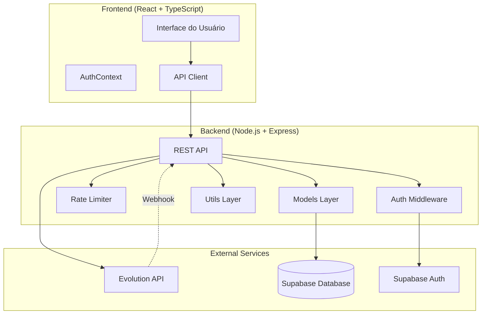

# Design Document: Sistema Multi-Tenant de Criação Automática de Instâncias WhatsApp

## Overview

Este documento descreve o design técnico de um sistema multi-tenant que automatiza a criação e gerenciamento de instâncias WhatsApp através da Evolution API. O sistema elimina a necessidade de configuração manual, permitindo que cada usuário conecte seu próprio WhatsApp de forma self-service através de um fluxo automatizado.

### Objetivos Principais

1. **Automação Completa**: Criação automática de instâncias WhatsApp sem intervenção manual
2. **Isolamento Multi-Tenant**: Cada usuário possui sua própria instância isolada
3. **Experiência Self-Service**: Interface intuitiva para conexão via QR Code
4. **Segurança**: Isolamento de dados e validação de webhooks
5. **Escalabilidade**: Suporte a múltiplos usuários simultâneos

### Fluxo de Usuário Principal

```
1. Usuário clica em "Conectar WhatsApp"
2. Sistema cria instância automaticamente
3. Sistema exibe QR Code
4. Usuário escaneia QR Code no WhatsApp
5. Sistema detecta conexão automaticamente
6. Usuário pode começar a usar
```

## Architecture

### Visão Geral da Arquitetura



### Camadas da Aplicação

#### 1. Frontend Layer
- **Tecnologia**: React 18 + TypeScript + Vite
- **Responsabilidades**:
  - Interface de usuário para conexão WhatsApp
  - Exibição de QR Code
  - Polling de status de conexão
  - Gerenciamento de estado de conexão

#### 2. Backend API Layer
- **Tecnologia**: Node.js + Express + TypeScript
- **Responsabilidades**:
  - Endpoints REST para operações de instância
  - Autenticação e autorização
  - Rate limiting
  - Orquestração de chamadas à Evolution API

#### 3. Models Layer
- **Responsabilidades**:
  - Acesso ao banco de dados
  - Lógica de negócio
  - Criptografia de dados sensíveis

#### 4. Utils Layer
- **Responsabilidades**:
  - Validação de webhooks
  - Criptografia/descriptografia
  - Normalização de dados
  - Logging estruturado

### Padrões Arquiteturais

1. **Repository Pattern**: Models encapsulam acesso ao banco de dados
2. **Middleware Pattern**: Autenticação, rate limiting e validação
3. **Service Layer**: Lógica de negócio isolada
4. **DTO Pattern**: Interfaces tipadas para transferência de dados

## Components and Interfaces

### Backend Components

#### 1. Instance Manager Service

```typescript
interface InstanceManagerService {
  /**
   * Cria uma nova instância WhatsApp para o usuário
   * @param userId - ID do usuário autenticado
   * @returns Dados da instância criada
   * @throws InstanceCreationError se falhar
   */
  createInstance(userId: string): Promise<InstanceData>;
  
  /**
   * Obtém QR Code da instância do usuário
   * @param userId - ID do usuário autenticado
   * @returns QR Code em base64
   * @throws QRCodeNotAvailableError se não disponível
   */
  getQRCode(userId: string): Promise<string>;
  
  /**
   * Verifica status de conexão da instância
   * @param userId - ID do usuário autenticado
   * @returns Status da conexão
   */
  getConnectionStatus(userId: string): Promise<ConnectionStatus>;
  
  /**
   * Desconecta instância do usuário
   * @param userId - ID do usuário autenticado
   */
  disconnectInstance(userId: string): Promise<void>;
  
  /**
   * Reconecta instância do usuário
   * @param userId - ID do usuário autenticado
   * @returns Novo QR Code
   */
  reconnectInstance(userId: string): Promise<string>;
}

interface InstanceData {
  instanceName: string;
  status: 'created' | 'connecting' | 'connected';
  createdAt: string;
}

type ConnectionStatus = 'disconnected' | 'connecting' | 'connected';
```

#### 2. Evolution API Client

```typescript
interface EvolutionAPIClient {
  /**
   * Cria instância na Evolution API
   * @param instanceName - Nome único da instância
   * @param webhookUrl - URL do webhook para eventos
   * @returns Dados da instância criada
   */
  createInstance(
    instanceName: string,
    webhookUrl: string
  ): Promise<EvolutionInstance>;
  
  /**
   * Obtém QR Code da instância
   * @param instanceName - Nome da instância
   * @returns QR Code em base64
   */
  getQRCode(instanceName: string): Promise<string>;
  
  /**
   * Verifica status de conexão
   * @param instanceName - Nome da instância
   * @returns Estado da conexão
   */
  getConnectionState(instanceName: string): Promise<ConnectionState>;
  
  /**
   * Remove instância
   * @param instanceName - Nome da instância
   */
  deleteInstance(instanceName: string): Promise<void>;
  
  /**
   * Configura webhook da instância
   * @param instanceName - Nome da instância
   * @param webhookConfig - Configuração do webhook
   */
  setWebhook(
    instanceName: string,
    webhookConfig: WebhookConfig
  ): Promise<void>;
}

interface EvolutionInstance {
  instance: {
    instanceName: string;
    status: string;
  };
  hash: {
    apikey: string;
  };
}

interface ConnectionState {
  instance: string;
  state: 'close' | 'connecting' | 'open';
}

interface WebhookConfig {
  url: string;
  webhook_by_events: boolean;
  webhook_base64: boolean;
  events: string[];
}
```

#### 3. Webhook Handler

```typescript
interface WebhookHandler {
  /**
   * Processa evento recebido do webhook
   * @param payload - Payload do evento
   * @param signature - Assinatura para validação
   * @returns Resultado do processamento
   */
  handleEvent(
    payload: WebhookPayload,
    signature: string
  ): Promise<WebhookResult>;
  
  /**
   * Valida assinatura do webhook
   * @param payload - Payload do evento
   * @param signature - Assinatura recebida
   * @param secret - Secret para validação
   * @returns true se válido
   */
  validateSignature(
    payload: string,
    signature: string,
    secret: string
  ): boolean;
}

interface WebhookPayload {
  event: string;
  instance: string;
  data: {
    key?: {
      remoteJid?: string;
      fromMe?: boolean;
    };
    pushName?: string;
    message?: any;
  };
  destination?: string;
  date_time?: string;
  sender?: string;
  server_url?: string;
  apikey?: string;
}

interface WebhookResult {
  success: boolean;
  message: string;
  clientId?: string;
}
```

#### 4. Rate Limiter

```typescript
interface RateLimiter {
  /**
   * Verifica se requisição deve ser limitada
   * @param key - Chave de identificação (userId)
   * @param limit - Número máximo de requisições
   * @param windowMs - Janela de tempo em ms
   * @returns true se limite excedido
   */
  isRateLimited(
    key: string,
    limit: number,
    windowMs: number
  ): boolean;
  
  /**
   * Reseta contador para uma chave
   * @param key - Chave de identificação
   */
  reset(key: string): void;
}

interface RateLimitRecord {
  count: number;
  resetTime: number;
}
```

### Frontend Components

#### 1. WhatsAppConnectionPage

```typescript
interface WhatsAppConnectionPageProps {}

interface WhatsAppConnectionPageState {
  status: 'idle' | 'creating' | 'waiting_scan' | 'connected' | 'error';
  qrCode: string | null;
  errorMessage: string | null;
  connectionInfo: ConnectionInfo | null;
}

interface ConnectionInfo {
  instanceName: string;
  connectedAt: string;
  phoneNumber?: string;
}
```

#### 2. QRCodeDisplay

```typescript
interface QRCodeDisplayProps {
  qrCode: string; // base64 image
  onRefresh: () => void;
  expiresIn?: number; // seconds
}
```

#### 3. ConnectionStatusIndicator

```typescript
interface ConnectionStatusIndicatorProps {
  status: ConnectionStatus;
  lastConnected?: string;
  onReconnect?: () => void;
  onDisconnect?: () => void;
}
```

#### 4. ConnectionHistoryList

```typescript
interface ConnectionHistoryListProps {
  history: ConnectionHistoryEntry[];
}

interface ConnectionHistoryEntry {
  id: string;
  event: 'connected' | 'disconnected';
  timestamp: string;
  details?: string;
}
```

### API Endpoints

#### Instance Management

```
POST /api/evolution/create-instance
- Autenticação: Required (Bearer token)
- Rate Limit: 3 requests / 10 minutes per user
- Request: {}
- Response: {
    instanceName: string;
    status: string;
    qrCode?: string;
  }
- Status Codes: 201 (Created), 200 (Existing), 401, 429, 500
```

```
GET /api/evolution/qrcode
- Autenticação: Required
- Request: {}
- Response: {
    qrCode: string; // base64
    expiresIn: number; // seconds
  }
- Status Codes: 200, 404, 401, 500
```

```
GET /api/evolution/connection-status
- Autenticação: Required
- Request: {}
- Response: {
    status: 'disconnected' | 'connecting' | 'connected';
    instanceName: string;
    connectedAt?: string;
  }
- Status Codes: 200, 401, 500
```

```
POST /api/evolution/disconnect
- Autenticação: Required
- Request: {}
- Response: {
    success: boolean;
    message: string;
  }
- Status Codes: 200, 401, 500
```

```
POST /api/evolution/reconnect
- Autenticação: Required
- Request: {}
- Response: {
    qrCode: string;
    instanceName: string;
  }
- Status Codes: 200, 401, 500
```

#### Webhook

```
POST /api/webhooks/evolution
- Autenticação: Signature validation
- Headers: {
    x-evolution-signature: string;
  }
- Request: WebhookPayload
- Response: {
    success: boolean;
    message: string;
  }
- Status Codes: 200, 400, 401, 429, 500
```

#### Admin Endpoints

```
GET /api/admin/active-connections
- Autenticação: Required (Admin role)
- Request: {}
- Response: {
    count: number;
    connections: Array<{
      userId: string;
      instanceName: string;
      connectedAt: string;
    }>;
  }
- Status Codes: 200, 401, 403, 500
```

```
GET /api/admin/inactive-instances
- Autenticação: Required (Admin role)
- Query: { days?: number }
- Response: {
    count: number;
    instances: Array<{
      userId: string;
      instanceName: string;
      lastActivity: string;
      inactiveDays: number;
    }>;
  }
- Status Codes: 200, 401, 403, 500
```

#### History

```
GET /api/evolution/connection-history
- Autenticação: Required
- Query: { limit?: number }
- Response: {
    history: ConnectionHistoryEntry[];
  }
- Status Codes: 200, 401, 500
```

## Data Models

### Database Schema

#### whatsapp_instances

```sql
CREATE TABLE whatsapp_instances (
  id UUID PRIMARY KEY DEFAULT gen_random_uuid(),
  user_id UUID NOT NULL REFERENCES auth.users(id) ON DELETE CASCADE,
  instance_name VARCHAR(255) NOT NULL UNIQUE,
  status VARCHAR(50) NOT NULL DEFAULT 'disconnected',
  encrypted_api_key TEXT,
  phone_number VARCHAR(20),
  connected_at TIMESTAMP WITH TIME ZONE,
  disconnected_at TIMESTAMP WITH TIME ZONE,
  last_activity_at TIMESTAMP WITH TIME ZONE,
  created_at TIMESTAMP WITH TIME ZONE DEFAULT NOW(),
  updated_at TIMESTAMP WITH TIME ZONE DEFAULT NOW(),
  
  CONSTRAINT unique_user_instance UNIQUE(user_id),
  CONSTRAINT valid_status CHECK (status IN ('disconnected', 'connecting', 'connected'))
);

CREATE INDEX idx_whatsapp_instances_user_id ON whatsapp_instances(user_id);
CREATE INDEX idx_whatsapp_instances_status ON whatsapp_instances(status);
CREATE INDEX idx_whatsapp_instances_last_activity ON whatsapp_instances(last_activity_at);
```

#### whatsapp_connection_history

```sql
CREATE TABLE whatsapp_connection_history (
  id UUID PRIMARY KEY DEFAULT gen_random_uuid(),
  user_id UUID NOT NULL REFERENCES auth.users(id) ON DELETE CASCADE,
  instance_name VARCHAR(255) NOT NULL,
  event_type VARCHAR(50) NOT NULL,
  status VARCHAR(50) NOT NULL,
  details JSONB,
  created_at TIMESTAMP WITH TIME ZONE DEFAULT NOW(),
  
  CONSTRAINT valid_event_type CHECK (event_type IN ('connected', 'disconnected', 'created', 'deleted', 'error'))
);

CREATE INDEX idx_connection_history_user_id ON whatsapp_connection_history(user_id);
CREATE INDEX idx_connection_history_created_at ON whatsapp_connection_history(created_at DESC);
```

#### whatsapp_webhook_logs

```sql
CREATE TABLE whatsapp_webhook_logs (
  id UUID PRIMARY KEY DEFAULT gen_random_uuid(),
  instance_name VARCHAR(255) NOT NULL,
  event_type VARCHAR(100) NOT NULL,
  payload JSONB NOT NULL,
  signature VARCHAR(255),
  signature_valid BOOLEAN,
  processed BOOLEAN DEFAULT FALSE,
  error_message TEXT,
  created_at TIMESTAMP WITH TIME ZONE DEFAULT NOW(),
  
  CONSTRAINT fk_instance FOREIGN KEY (instance_name) 
    REFERENCES whatsapp_instances(instance_name) ON DELETE CASCADE
);

CREATE INDEX idx_webhook_logs_instance ON whatsapp_webhook_logs(instance_name);
CREATE INDEX idx_webhook_logs_created_at ON whatsapp_webhook_logs(created_at DESC);
CREATE INDEX idx_webhook_logs_processed ON whatsapp_webhook_logs(processed);
```

#### rate_limit_records

```sql
CREATE TABLE rate_limit_records (
  id UUID PRIMARY KEY DEFAULT gen_random_uuid(),
  user_id UUID NOT NULL REFERENCES auth.users(id) ON DELETE CASCADE,
  endpoint VARCHAR(255) NOT NULL,
  request_count INTEGER NOT NULL DEFAULT 1,
  window_start TIMESTAMP WITH TIME ZONE NOT NULL,
  window_end TIMESTAMP WITH TIME ZONE NOT NULL,
  created_at TIMESTAMP WITH TIME ZONE DEFAULT NOW(),
  updated_at TIMESTAMP WITH TIME ZONE DEFAULT NOW(),
  
  CONSTRAINT unique_user_endpoint_window UNIQUE(user_id, endpoint, window_start)
);

CREATE INDEX idx_rate_limit_user_endpoint ON rate_limit_records(user_id, endpoint);
CREATE INDEX idx_rate_limit_window_end ON rate_limit_records(window_end);
```

### TypeScript Interfaces

```typescript
// Database Models
interface WhatsAppInstance {
  id: string;
  userId: string;
  instanceName: string;
  status: 'disconnected' | 'connecting' | 'connected';
  encryptedApiKey?: string;
  phoneNumber?: string;
  connectedAt?: string;
  disconnectedAt?: string;
  lastActivityAt?: string;
  createdAt: string;
  updatedAt: string;
}

interface ConnectionHistoryEntry {
  id: string;
  userId: string;
  instanceName: string;
  eventType: 'connected' | 'disconnected' | 'created' | 'deleted' | 'error';
  status: string;
  details?: Record<string, any>;
  createdAt: string;
}

interface WebhookLog {
  id: string;
  instanceName: string;
  eventType: string;
  payload: Record<string, any>;
  signature?: string;
  signatureValid?: boolean;
  processed: boolean;
  errorMessage?: string;
  createdAt: string;
}

interface RateLimitRecord {
  id: string;
  userId: string;
  endpoint: string;
  requestCount: number;
  windowStart: string;
  windowEnd: string;
  createdAt: string;
  updatedAt: string;
}
```

### Environment Variables

```typescript
interface EnvironmentConfig {
  // Evolution API
  EVOLUTION_API_URL: string;           // URL base da Evolution API
  EVOLUTION_API_GLOBAL_KEY: string;    // Chave global de admin
  
  // Backend
  BACKEND_URL: string;                 // URL do backend para webhooks
  PORT: number;                        // Porta do servidor
  
  // Database
  SUPABASE_URL: string;                // URL do Supabase
  SUPABASE_SERVICE_KEY: string;        // Service key do Supabase
  
  // Security
  ENCRYPTION_KEY: string;              // Chave para criptografia (32 bytes)
  WEBHOOK_SECRET: string;              // Secret para validação de webhooks
  
  // Rate Limiting
  RATE_LIMIT_WINDOW_MS: number;        // Janela de rate limit (default: 600000)
  RATE_LIMIT_MAX_REQUESTS: number;     // Max requests por janela (default: 3)
  
  // Polling
  QR_CODE_EXPIRY_SECONDS: number;      // Tempo de expiração do QR (default: 60)
  MAX_POLLING_ATTEMPTS: number;        // Max tentativas de polling (default: 60)
  POLLING_INTERVAL_MS: number;         // Intervalo de polling (default: 3000)
}
```

## Correctness Properties

*Uma propriedade é uma característica ou comportamento que deve ser verdadeiro em todas as execuções válidas de um sistema - essencialmente, uma declaração formal sobre o que o sistema deve fazer. As propriedades servem como ponte entre especificações legíveis por humanos e garantias de correção verificáveis por máquina.*


### Property Reflection

Após análise dos 25 requisitos com 150+ critérios de aceitação, identifiquei as seguintes redundâncias:

**Redundâncias Identificadas:**

1. **Isolamento Multi-Tenant** (3.6, 4.6, 10.2, 10.3, 10.4, 25.6): Todos testam que usuário só acessa próprios recursos. Podem ser consolidados em uma propriedade geral.

2. **Logging de Operações** (2.6, 11.6, 12.3, 13.6, 16.1, 16.2, 16.4, 19.6): Múltiplos requisitos sobre logging. Consolidar em propriedades por tipo de operação.

3. **Validação de Autenticação** (1.6, 2.2, 2.3): Testam autenticação em diferentes contextos. Consolidar em propriedade geral.

4. **Status HTTP Apropriados** (2.3, 2.4, 2.5, 3.5, 11.3, 13.5, 19.2, 20.5): Múltiplos testes de códigos HTTP. Agrupar por tipo de operação.

5. **Reutilização de Instância** (1.5, 13.1, 13.2, 13.3): Testam idempotência de criação. Consolidar em uma propriedade.

6. **Exibição de UI** (6.3, 6.4, 6.5, 8.1, 8.2, 8.4): Múltiplos testes de renderização. Consolidar por estado.

**Propriedades Consolidadas:**

Após reflexão, reduzi de ~100 propriedades potenciais para 35 propriedades essenciais que fornecem cobertura completa sem redundância.

### Property 1: Instance Name Generation Format

*For any* userId, when generating an instance name, the result should match the format "user-{userId}".

**Validates: Requirements 1.1**

### Property 2: Instance Creation Idempotency

*For any* user, creating an instance multiple times should result in the same instance being returned (idempotent operation).

**Validates: Requirements 1.5, 13.1, 13.2**

### Property 3: Instance Persistence After Creation

*For any* successful instance creation, the instance configuration should be persisted in the database and retrievable.

**Validates: Requirements 1.3**

### Property 4: Error Messages Are Descriptive

*For any* error returned by the Evolution API, the backend should return a descriptive error message to the user (not just error codes).

**Validates: Requirements 1.4, 2.5**

### Property 5: Authentication Required for All Operations

*For any* protected endpoint, requests without valid authentication should be rejected with HTTP 401.

**Validates: Requirements 1.6, 2.2, 2.3**

### Property 6: Multi-Tenant Isolation

*For any* two different users A and B, user A should not be able to access, modify, or view any resources (instance, QR code, status, history) belonging to user B.

**Validates: Requirements 3.6, 4.6, 10.1, 10.2, 10.3, 10.4, 25.6**

### Property 7: QR Code Base64 Format

*For any* available QR code, the backend should return it in valid base64 image format.

**Validates: Requirements 3.3**

### Property 8: QR Code Auto-Refresh on Expiry

*For any* expired QR code, when requested, the backend should automatically generate and return a new QR code.

**Validates: Requirements 3.4, 14.1**

### Property 9: Connection Status Valid Values

*For any* connection status query, the response should contain one of exactly three valid values: "disconnected", "connecting", or "connected".

**Validates: Requirements 4.3**

### Property 10: Webhook Auto-Configuration

*For any* successfully created instance, a webhook should be automatically configured pointing to {BACKEND_URL}/api/webhooks/evolution.

**Validates: Requirements 5.1, 5.2**

### Property 11: Webhook Events Enabled

*For any* configured webhook, message received events should be enabled.

**Validates: Requirements 5.3**

### Property 12: Webhook Failure Non-Blocking

*For any* instance creation, if webhook configuration fails, the instance creation should still succeed (webhook failure is non-blocking).

**Validates: Requirements 5.4**

### Property 13: Webhook Signature Validation

*For any* webhook request, if the signature is invalid, the request should be rejected with HTTP 401.

**Validates: Requirements 10.6, 19.1, 19.2**

### Property 14: Webhook Signature Algorithm

*For any* webhook payload and secret, signature validation should use HMAC-SHA256 algorithm.

**Validates: Requirements 19.4**

### Property 15: Rate Limiting Enforcement

*For any* user making more than 3 instance creation requests within 10 minutes, subsequent requests should be rejected with HTTP 429 and include "Retry-After" header.

**Validates: Requirements 11.2, 11.3, 11.4**

### Property 16: Rate Limiting Per User

*For any* two different users A and B, rate limiting for user A should not affect user B's ability to make requests.

**Validates: Requirements 11.5**

### Property 17: QR Code Rate Limiting

*For any* user, QR code generation should be limited to maximum 1 request per minute.

**Validates: Requirements 14.6**

### Property 18: Timeout Handling

*For any* Evolution API request that doesn't respond within 10 seconds, the backend should consider it a timeout and return appropriate error.

**Validates: Requirements 12.1, 12.2**

### Property 19: Retry with Exponential Backoff

*For any* failed Evolution API request, the backend should retry up to 3 times with exponential backoff before returning error.

**Validates: Requirements 12.5, 12.6**

### Property 20: Orphaned Instance Recreation

*For any* instance that exists in database but not in Evolution API, when user requests connection, a new instance should be created in Evolution API.

**Validates: Requirements 13.3, 13.4**

### Property 21: Webhook Event Parsing Round-Trip

*For any* valid webhook event, parsing the JSON and then serializing it back should produce an equivalent structure.

**Validates: Requirements 20.6**

### Property 22: Connection Status Update on Webhook

*For any* webhook event of type "connection.update", the connection status in the database should be updated accordingly.

**Validates: Requirements 15.1, 20.3**

### Property 23: Message Processing on Webhook

*For any* webhook event of type "messages.upsert", the message should be processed and logged.

**Validates: Requirements 20.4**

### Property 24: Credential Encryption Round-Trip

*For any* sensitive credential, encrypting and then decrypting should produce the original value.

**Validates: Requirements 10.5**

### Property 25: Environment Variable Validation

*For any* missing required environment variable (EVOLUTION_API_URL, EVOLUTION_API_GLOBAL_KEY, BACKEND_URL), the backend should fail to start with a clear error message.

**Validates: Requirements 9.3**

### Property 26: URL Format Validation

*For any* EVOLUTION_API_URL value, the backend should validate it is a properly formatted URL before using it.

**Validates: Requirements 9.4**

### Property 27: API Key Header Presence

*For any* request to Evolution API, the "apikey" header should be present with the configured EVOLUTION_API_GLOBAL_KEY value.

**Validates: Requirements 9.5**

### Property 28: Concurrent Instance Creation

*For any* two users creating instances simultaneously, both operations should complete successfully without conflicts.

**Validates: Requirements 18.1, 18.3**

### Property 29: Database Transaction Safety

*For any* instance creation operation, database operations should use transactions to prevent race conditions.

**Validates: Requirements 18.2**

### Property 30: Instance Name Uniqueness

*For any* two instances, their instance names should be unique (enforced by database constraint).

**Validates: Requirements 18.4**

### Property 31: Pretty Printer Structure Preservation

*For any* webhook event, formatting with pretty printer and then parsing should preserve the original structure.

**Validates: Requirements 21.6**

### Property 32: Pretty Printer Sensitive Data Omission

*For any* webhook event containing sensitive fields (tokens, keys, passwords), the pretty printer should omit these fields from the output.

**Validates: Requirements 21.3**

### Property 33: Pretty Printer Payload Truncation

*For any* webhook payload larger than 1KB, the pretty printer should truncate it with an indicator.

**Validates: Requirements 21.5**

### Property 34: Inactive Instance Detection

*For any* instance with no activity for 30 days, it should be included in the inactive instances list.

**Validates: Requirements 22.3, 22.4**

### Property 35: Connection History Recording

*For any* connection or disconnection event, an entry should be created in the connection history with timestamp, event type, and status.

**Validates: Requirements 25.1, 25.4**


## Error Handling

### Error Categories

#### 1. Authentication Errors

```typescript
class AuthenticationError extends Error {
  statusCode = 401;
  code = 'UNAUTHORIZED';
  
  constructor(message: string = 'Authentication required') {
    super(message);
    this.name = 'AuthenticationError';
  }
}

// Usage scenarios:
// - Missing or invalid JWT token
// - Expired authentication token
// - Invalid webhook signature
```

#### 2. Authorization Errors

```typescript
class AuthorizationError extends Error {
  statusCode = 403;
  code = 'FORBIDDEN';
  
  constructor(message: string = 'Access denied') {
    super(message);
    this.name = 'AuthorizationError';
  }
}

// Usage scenarios:
// - User trying to access another user's instance
// - Non-admin accessing admin endpoints
// - Insufficient permissions
```

#### 3. Rate Limit Errors

```typescript
class RateLimitError extends Error {
  statusCode = 429;
  code = 'RATE_LIMIT_EXCEEDED';
  retryAfter: number;
  
  constructor(retryAfter: number = 60) {
    super('Rate limit exceeded. Please try again later.');
    this.name = 'RateLimitError';
    this.retryAfter = retryAfter;
  }
}

// Usage scenarios:
// - More than 3 instance creations in 10 minutes
// - More than 1 QR code request per minute
// - More than 100 webhook events per minute per instance
```

#### 4. Evolution API Errors

```typescript
class EvolutionAPIError extends Error {
  statusCode: number;
  code: string;
  originalError?: any;
  
  constructor(message: string, statusCode: number = 500, originalError?: any) {
    super(message);
    this.name = 'EvolutionAPIError';
    this.statusCode = statusCode;
    this.code = 'EVOLUTION_API_ERROR';
    this.originalError = originalError;
  }
}

// Usage scenarios:
// - Evolution API is offline/unreachable
// - Evolution API returns error response
// - Timeout connecting to Evolution API
// - Invalid response from Evolution API
```

#### 5. Instance Errors

```typescript
class InstanceNotFoundError extends Error {
  statusCode = 404;
  code = 'INSTANCE_NOT_FOUND';
  
  constructor(instanceName: string) {
    super(`Instance ${instanceName} not found`);
    this.name = 'InstanceNotFoundError';
  }
}

class InstanceCreationError extends Error {
  statusCode = 500;
  code = 'INSTANCE_CREATION_FAILED';
  
  constructor(message: string, public originalError?: any) {
    super(message);
    this.name = 'InstanceCreationError';
  }
}

class QRCodeNotAvailableError extends Error {
  statusCode = 404;
  code = 'QR_CODE_NOT_AVAILABLE';
  
  constructor(message: string = 'QR Code not available') {
    super(message);
    this.name = 'QRCodeNotAvailableError';
  }
}
```

#### 6. Validation Errors

```typescript
class ValidationError extends Error {
  statusCode = 400;
  code = 'VALIDATION_ERROR';
  fields?: Record<string, string>;
  
  constructor(message: string, fields?: Record<string, string>) {
    super(message);
    this.name = 'ValidationError';
    this.fields = fields;
  }
}

// Usage scenarios:
// - Missing required fields
// - Invalid URL format
// - Invalid phone number format
// - Invalid webhook payload structure
```

### Error Response Format

All API errors should follow a consistent format:

```typescript
interface ErrorResponse {
  error: {
    code: string;
    message: string;
    details?: any;
    requestId?: string;
    timestamp: string;
  };
}

// Example:
{
  "error": {
    "code": "RATE_LIMIT_EXCEEDED",
    "message": "Too many instance creation requests. Please try again in 8 minutes.",
    "details": {
      "retryAfter": 480,
      "limit": 3,
      "window": "10 minutes"
    },
    "requestId": "req_abc123xyz",
    "timestamp": "2024-01-15T10:30:00Z"
  }
}
```

### Error Handling Strategies

#### 1. Retry Logic with Exponential Backoff

```typescript
async function retryWithBackoff<T>(
  operation: () => Promise<T>,
  maxRetries: number = 3,
  baseDelay: number = 1000
): Promise<T> {
  let lastError: Error;
  
  for (let attempt = 0; attempt < maxRetries; attempt++) {
    try {
      return await operation();
    } catch (error) {
      lastError = error as Error;
      
      // Don't retry on client errors (4xx)
      if (error instanceof ValidationError || 
          error instanceof AuthenticationError ||
          error instanceof AuthorizationError) {
        throw error;
      }
      
      // Calculate delay with exponential backoff
      const delay = baseDelay * Math.pow(2, attempt);
      await new Promise(resolve => setTimeout(resolve, delay));
    }
  }
  
  throw new Error(`Operation failed after ${maxRetries} attempts: ${lastError!.message}`);
}
```

#### 2. Circuit Breaker Pattern

```typescript
class CircuitBreaker {
  private failureCount = 0;
  private lastFailureTime?: number;
  private state: 'CLOSED' | 'OPEN' | 'HALF_OPEN' = 'CLOSED';
  
  constructor(
    private threshold: number = 5,
    private timeout: number = 60000 // 1 minute
  ) {}
  
  async execute<T>(operation: () => Promise<T>): Promise<T> {
    if (this.state === 'OPEN') {
      if (Date.now() - this.lastFailureTime! > this.timeout) {
        this.state = 'HALF_OPEN';
      } else {
        throw new Error('Circuit breaker is OPEN');
      }
    }
    
    try {
      const result = await operation();
      this.onSuccess();
      return result;
    } catch (error) {
      this.onFailure();
      throw error;
    }
  }
  
  private onSuccess() {
    this.failureCount = 0;
    this.state = 'CLOSED';
  }
  
  private onFailure() {
    this.failureCount++;
    this.lastFailureTime = Date.now();
    
    if (this.failureCount >= this.threshold) {
      this.state = 'OPEN';
    }
  }
}
```

#### 3. Graceful Degradation

```typescript
// Example: If webhook configuration fails, instance creation still succeeds
async function createInstanceWithWebhook(userId: string): Promise<InstanceData> {
  // Create instance (critical operation)
  const instance = await createInstance(userId);
  
  try {
    // Configure webhook (non-critical operation)
    await configureWebhook(instance.instanceName);
  } catch (error) {
    // Log error but don't fail the entire operation
    logger.warn('Webhook configuration failed, but instance was created', {
      userId,
      instanceName: instance.instanceName,
      error: error.message
    });
  }
  
  return instance;
}
```

### Frontend Error Handling

#### User-Friendly Error Messages

```typescript
const ERROR_MESSAGES: Record<string, string> = {
  'UNAUTHORIZED': 'Sua sessão expirou. Por favor, faça login novamente.',
  'RATE_LIMIT_EXCEEDED': 'Você fez muitas tentativas. Por favor, aguarde alguns minutos.',
  'EVOLUTION_API_ERROR': 'Serviço WhatsApp temporariamente indisponível. Tente novamente em alguns minutos.',
  'INSTANCE_NOT_FOUND': 'Instância WhatsApp não encontrada. Por favor, conecte novamente.',
  'QR_CODE_NOT_AVAILABLE': 'QR Code não disponível. Gerando novo código...',
  'VALIDATION_ERROR': 'Dados inválidos. Por favor, verifique as informações.',
  'NETWORK_ERROR': 'Erro de conexão. Verifique sua internet e tente novamente.'
};

function getUserFriendlyMessage(errorCode: string): string {
  return ERROR_MESSAGES[errorCode] || 'Ocorreu um erro inesperado. Por favor, tente novamente.';
}
```

#### Error Recovery Actions

```typescript
interface ErrorRecoveryAction {
  label: string;
  action: () => void;
}

function getRecoveryActions(errorCode: string): ErrorRecoveryAction[] {
  switch (errorCode) {
    case 'UNAUTHORIZED':
      return [{ label: 'Fazer Login', action: () => redirectToLogin() }];
    
    case 'QR_CODE_NOT_AVAILABLE':
      return [{ label: 'Gerar Novo QR Code', action: () => generateNewQRCode() }];
    
    case 'RATE_LIMIT_EXCEEDED':
      return [{ label: 'Entendi', action: () => closeErrorModal() }];
    
    case 'EVOLUTION_API_ERROR':
      return [
        { label: 'Tentar Novamente', action: () => retryOperation() },
        { label: 'Cancelar', action: () => closeErrorModal() }
      ];
    
    default:
      return [{ label: 'OK', action: () => closeErrorModal() }];
  }
}
```

### Logging Strategy

#### Structured Logging

```typescript
interface LogEntry {
  level: 'info' | 'warn' | 'error';
  message: string;
  requestId: string;
  userId?: string;
  instanceName?: string;
  operation: string;
  duration?: number;
  error?: {
    name: string;
    message: string;
    stack?: string;
  };
  metadata?: Record<string, any>;
  timestamp: string;
}

// Example usage:
logger.error('Instance creation failed', {
  requestId: 'req_123',
  userId: 'user_456',
  operation: 'createInstance',
  duration: 1250,
  error: {
    name: 'EvolutionAPIError',
    message: 'Connection timeout',
    stack: error.stack
  },
  metadata: {
    evolutionApiUrl: config.apiUrl,
    attemptNumber: 3
  }
});
```

#### Log Levels

- **INFO**: Normal operations (instance created, QR code generated, connection established)
- **WARN**: Non-critical issues (webhook config failed, QR code expired, rate limit approaching)
- **ERROR**: Critical failures (instance creation failed, database error, Evolution API unreachable)


## Testing Strategy

### Overview

O sistema utilizará uma abordagem dual de testes:

1. **Unit Tests**: Para casos específicos, edge cases e exemplos concretos
2. **Property-Based Tests**: Para propriedades universais que devem valer para todos os inputs

Esta combinação garante cobertura completa: unit tests capturam bugs concretos, enquanto property tests verificam correção geral.

### Property-Based Testing

#### Framework

Utilizaremos **fast-check** para TypeScript/JavaScript, que é a biblioteca padrão para property-based testing no ecossistema Node.js.

```bash
npm install --save-dev fast-check @types/fast-check
```

#### Configuration

Cada property test deve:
- Executar mínimo 100 iterações (devido à randomização)
- Incluir tag de referência ao design document
- Usar geradores apropriados para o domínio

#### Tag Format

```typescript
/**
 * Feature: whatsapp-multi-tenant-auto-instance
 * Property 1: Instance Name Generation Format
 * 
 * For any userId, when generating an instance name,
 * the result should match the format "user-{userId}".
 */
```

#### Example Property Tests

```typescript
import fc from 'fast-check';
import { generateInstanceName } from './instanceManager';

describe('Property Tests - Instance Manager', () => {
  /**
   * Feature: whatsapp-multi-tenant-auto-instance
   * Property 1: Instance Name Generation Format
   */
  it('should generate instance names in correct format for any userId', () => {
    fc.assert(
      fc.property(
        fc.uuid(), // Generate random UUIDs as userIds
        (userId) => {
          const instanceName = generateInstanceName(userId);
          expect(instanceName).toBe(`user-${userId}`);
        }
      ),
      { numRuns: 100 }
    );
  });

  /**
   * Feature: whatsapp-multi-tenant-auto-instance
   * Property 2: Instance Creation Idempotency
   */
  it('should return same instance when created multiple times', async () => {
    fc.assert(
      fc.asyncProperty(
        fc.uuid(),
        async (userId) => {
          const instance1 = await createInstance(userId);
          const instance2 = await createInstance(userId);
          
          expect(instance1.instanceName).toBe(instance2.instanceName);
          expect(instance1.id).toBe(instance2.id);
        }
      ),
      { numRuns: 100 }
    );
  });

  /**
   * Feature: whatsapp-multi-tenant-auto-instance
   * Property 6: Multi-Tenant Isolation
   */
  it('should prevent users from accessing other users resources', async () => {
    fc.assert(
      fc.asyncProperty(
        fc.tuple(fc.uuid(), fc.uuid()).filter(([a, b]) => a !== b),
        async ([userA, userB]) => {
          // Create instance for user A
          const instanceA = await createInstance(userA);
          
          // Try to access as user B
          await expect(
            getQRCode(userB, instanceA.instanceName)
          ).rejects.toThrow(AuthorizationError);
        }
      ),
      { numRuns: 100 }
    );
  });

  /**
   * Feature: whatsapp-multi-tenant-auto-instance
   * Property 9: Connection Status Valid Values
   */
  it('should always return valid connection status values', async () => {
    fc.assert(
      fc.asyncProperty(
        fc.uuid(),
        async (userId) => {
          const status = await getConnectionStatus(userId);
          expect(['disconnected', 'connecting', 'connected']).toContain(status);
        }
      ),
      { numRuns: 100 }
    );
  });

  /**
   * Feature: whatsapp-multi-tenant-auto-instance
   * Property 21: Webhook Event Parsing Round-Trip
   */
  it('should preserve structure when parsing and serializing webhook events', () => {
    fc.assert(
      fc.property(
        webhookEventGenerator(), // Custom generator for webhook events
        (event) => {
          const parsed = parseWebhookEvent(JSON.stringify(event));
          const serialized = JSON.parse(JSON.stringify(parsed));
          expect(serialized).toEqual(event);
        }
      ),
      { numRuns: 100 }
    );
  });

  /**
   * Feature: whatsapp-multi-tenant-auto-instance
   * Property 24: Credential Encryption Round-Trip
   */
  it('should decrypt to original value after encryption', () => {
    fc.assert(
      fc.property(
        fc.string({ minLength: 1, maxLength: 100 }),
        (credential) => {
          const encrypted = encryptApiKey(credential);
          const decrypted = decryptApiKey(encrypted);
          expect(decrypted).toBe(credential);
        }
      ),
      { numRuns: 100 }
    );
  });
});
```

#### Custom Generators

```typescript
// Generator for webhook events
function webhookEventGenerator() {
  return fc.record({
    event: fc.constantFrom('connection.update', 'messages.upsert'),
    instance: fc.string({ minLength: 5, maxLength: 50 }),
    data: fc.record({
      key: fc.option(fc.record({
        remoteJid: fc.string(),
        fromMe: fc.boolean()
      })),
      pushName: fc.option(fc.string()),
      message: fc.option(fc.object())
    }),
    date_time: fc.date().map(d => d.toISOString()),
    sender: fc.string()
  });
}

// Generator for user IDs
function userIdGenerator() {
  return fc.uuid();
}

// Generator for instance names
function instanceNameGenerator() {
  return fc.uuid().map(id => `user-${id}`);
}

// Generator for phone numbers
function phoneNumberGenerator() {
  return fc.tuple(
    fc.constantFrom('+55'), // Country code
    fc.integer({ min: 11, max: 99 }), // Area code
    fc.integer({ min: 900000000, max: 999999999 }) // Number
  ).map(([country, area, number]) => `${country}${area}${number}`);
}
```

### Unit Testing

#### Test Structure

```typescript
describe('InstanceManager', () => {
  describe('createInstance', () => {
    it('should create instance with correct name format', async () => {
      const userId = 'test-user-123';
      const instance = await createInstance(userId);
      
      expect(instance.instanceName).toBe('user-test-user-123');
    });

    it('should throw AuthenticationError when user is not authenticated', async () => {
      await expect(createInstance(null as any))
        .rejects
        .toThrow(AuthenticationError);
    });

    it('should handle Evolution API timeout gracefully', async () => {
      mockEvolutionAPI.timeout();
      
      await expect(createInstance('user-123'))
        .rejects
        .toThrow('Serviço WhatsApp temporariamente indisponível');
    });
  });

  describe('getQRCode', () => {
    it('should return base64 encoded QR code', async () => {
      const qrCode = await getQRCode('user-123');
      
      expect(qrCode).toMatch(/^data:image\/png;base64,/);
    });

    it('should return 404 when QR code is not available', async () => {
      mockEvolutionAPI.noQRCode();
      
      await expect(getQRCode('user-123'))
        .rejects
        .toThrow(QRCodeNotAvailableError);
    });

    it('should generate new QR code when expired', async () => {
      mockEvolutionAPI.expiredQRCode();
      
      const qrCode = await getQRCode('user-123');
      
      expect(qrCode).toBeDefined();
      expect(mockEvolutionAPI.generateQRCodeCalled).toBe(true);
    });
  });
});
```

#### Edge Cases to Test

1. **Empty/Null Values**
   - Empty userId
   - Null authentication token
   - Empty webhook payload

2. **Boundary Values**
   - Rate limit exactly at threshold
   - QR code at expiration time
   - Maximum payload size

3. **Concurrent Operations**
   - Two users creating instances simultaneously
   - Multiple QR code requests in parallel
   - Webhook events arriving during instance creation

4. **Error Conditions**
   - Evolution API returns 500
   - Database connection lost
   - Invalid webhook signature
   - Malformed JSON in webhook

### Integration Testing

#### Test Scenarios

```typescript
describe('Integration Tests - WhatsApp Connection Flow', () => {
  it('should complete full connection flow', async () => {
    // 1. User requests instance creation
    const createResponse = await request(app)
      .post('/api/evolution/create-instance')
      .set('Authorization', `Bearer ${userToken}`)
      .expect(201);
    
    expect(createResponse.body.instanceName).toBeDefined();
    
    // 2. User requests QR code
    const qrResponse = await request(app)
      .get('/api/evolution/qrcode')
      .set('Authorization', `Bearer ${userToken}`)
      .expect(200);
    
    expect(qrResponse.body.qrCode).toMatch(/^data:image/);
    
    // 3. Simulate WhatsApp connection via webhook
    const webhookPayload = {
      event: 'connection.update',
      instance: createResponse.body.instanceName,
      data: { state: 'open' }
    };
    
    await request(app)
      .post('/api/webhooks/evolution')
      .set('x-evolution-signature', generateSignature(webhookPayload))
      .send(webhookPayload)
      .expect(200);
    
    // 4. Verify connection status
    const statusResponse = await request(app)
      .get('/api/evolution/connection-status')
      .set('Authorization', `Bearer ${userToken}`)
      .expect(200);
    
    expect(statusResponse.body.status).toBe('connected');
  });

  it('should handle disconnection and reconnection', async () => {
    // Setup: Create and connect instance
    await setupConnectedInstance(userId);
    
    // 1. Disconnect
    await request(app)
      .post('/api/evolution/disconnect')
      .set('Authorization', `Bearer ${userToken}`)
      .expect(200);
    
    // 2. Verify disconnected status
    const statusResponse = await request(app)
      .get('/api/evolution/connection-status')
      .set('Authorization', `Bearer ${userToken}`)
      .expect(200);
    
    expect(statusResponse.body.status).toBe('disconnected');
    
    // 3. Reconnect
    const reconnectResponse = await request(app)
      .post('/api/evolution/reconnect')
      .set('Authorization', `Bearer ${userToken}`)
      .expect(200);
    
    expect(reconnectResponse.body.qrCode).toBeDefined();
  });
});
```

### Test Coverage Goals

- **Unit Tests**: 80% code coverage minimum
- **Property Tests**: All 35 correctness properties implemented
- **Integration Tests**: All critical user flows covered
- **E2E Tests**: Main happy path + 3 error scenarios

### Mocking Strategy

#### Evolution API Mock

```typescript
class MockEvolutionAPI {
  private responses: Map<string, any> = new Map();
  
  mockCreateInstance(instanceName: string, response: any) {
    this.responses.set(`create:${instanceName}`, response);
  }
  
  mockGetQRCode(instanceName: string, qrCode: string) {
    this.responses.set(`qr:${instanceName}`, qrCode);
  }
  
  mockConnectionState(instanceName: string, state: string) {
    this.responses.set(`state:${instanceName}`, state);
  }
  
  timeout() {
    // Simulate timeout by delaying response beyond threshold
  }
  
  serverError() {
    // Simulate 500 error
  }
}
```

#### Database Mock

```typescript
class MockDatabase {
  private data: Map<string, any> = new Map();
  
  async insert(table: string, record: any) {
    const id = generateId();
    this.data.set(`${table}:${id}`, { ...record, id });
    return { ...record, id };
  }
  
  async findOne(table: string, query: any) {
    // Simple in-memory query implementation
  }
  
  async update(table: string, id: string, updates: any) {
    const key = `${table}:${id}`;
    const existing = this.data.get(key);
    this.data.set(key, { ...existing, ...updates });
  }
}
```

### Continuous Integration

#### Test Pipeline

```yaml
# .github/workflows/test.yml
name: Tests

on: [push, pull_request]

jobs:
  test:
    runs-on: ubuntu-latest
    
    steps:
      - uses: actions/checkout@v2
      
      - name: Setup Node.js
        uses: actions/setup-node@v2
        with:
          node-version: '18'
      
      - name: Install dependencies
        run: npm ci
      
      - name: Run unit tests
        run: npm run test:unit
      
      - name: Run property tests
        run: npm run test:property
      
      - name: Run integration tests
        run: npm run test:integration
      
      - name: Generate coverage report
        run: npm run test:coverage
      
      - name: Upload coverage to Codecov
        uses: codecov/codecov-action@v2
```

### Test Commands

```json
{
  "scripts": {
    "test": "jest",
    "test:unit": "jest --testPathPattern=\\.test\\.ts$",
    "test:property": "jest --testPathPattern=\\.property\\.test\\.ts$",
    "test:integration": "jest --testPathPattern=\\.integration\\.test\\.ts$",
    "test:e2e": "jest --testPathPattern=\\.e2e\\.test\\.ts$",
    "test:coverage": "jest --coverage",
    "test:watch": "jest --watch"
  }
}
```

### Performance Testing

#### Load Testing Scenarios

1. **Concurrent Instance Creation**
   - 10 users creating instances simultaneously
   - Verify no race conditions or conflicts
   - Response time < 3 seconds per request

2. **Webhook Burst**
   - 100 webhook events in 1 second
   - Verify rate limiting works correctly
   - No events lost or duplicated

3. **Polling Load**
   - 50 users polling connection status every 3 seconds
   - Verify system remains responsive
   - Database queries optimized

```typescript
// Example load test with k6
import http from 'k6/http';
import { check, sleep } from 'k6';

export const options = {
  stages: [
    { duration: '30s', target: 10 },  // Ramp up to 10 users
    { duration: '1m', target: 10 },   // Stay at 10 users
    { duration: '30s', target: 0 },   // Ramp down
  ],
};

export default function () {
  const token = 'test-token';
  
  // Create instance
  const createRes = http.post(
    'http://localhost:3000/api/evolution/create-instance',
    null,
    { headers: { Authorization: `Bearer ${token}` } }
  );
  
  check(createRes, {
    'instance created': (r) => r.status === 201,
    'response time < 3s': (r) => r.timings.duration < 3000,
  });
  
  sleep(1);
}
```

## Security Considerations

### Authentication & Authorization

1. **JWT Token Validation**: All protected endpoints validate Supabase JWT tokens
2. **Multi-Tenant Isolation**: Users can only access their own resources
3. **Admin Role Verification**: Admin endpoints require admin role in JWT claims

### Data Protection

1. **Encryption at Rest**: API keys encrypted using AES-256 before database storage
2. **Encryption in Transit**: All API communication over HTTPS
3. **Webhook Signature Validation**: HMAC-SHA256 signature verification for all webhooks

### Rate Limiting

1. **Instance Creation**: 3 requests per 10 minutes per user
2. **QR Code Generation**: 1 request per minute per user
3. **Webhook Events**: 100 events per minute per instance

### Input Validation

1. **URL Validation**: Evolution API URL must be valid HTTPS URL
2. **Phone Number Validation**: Phone numbers normalized and validated
3. **JSON Schema Validation**: Webhook payloads validated against schema

### Audit Logging

1. **All Operations Logged**: Instance creation, deletion, connection events
2. **Security Events**: Failed authentication, invalid signatures, rate limit violations
3. **Request Tracing**: Unique request ID for correlation across logs

## Deployment Considerations

### Environment Variables

Required variables must be set before deployment:

```bash
# Evolution API
EVOLUTION_API_URL=https://evolution-api.example.com
EVOLUTION_API_GLOBAL_KEY=your-global-api-key

# Backend
BACKEND_URL=https://your-backend.example.com
PORT=3000

# Database
SUPABASE_URL=https://your-project.supabase.co
SUPABASE_SERVICE_KEY=your-service-key

# Security
ENCRYPTION_KEY=your-32-byte-encryption-key
WEBHOOK_SECRET=your-webhook-secret

# Optional
RATE_LIMIT_WINDOW_MS=600000
RATE_LIMIT_MAX_REQUESTS=3
QR_CODE_EXPIRY_SECONDS=60
```

### Database Migrations

Run migrations in order:

```bash
# 1. Create whatsapp_instances table
psql -f migrations/001_create_whatsapp_instances.sql

# 2. Create connection_history table
psql -f migrations/002_create_connection_history.sql

# 3. Create webhook_logs table
psql -f migrations/003_create_webhook_logs.sql

# 4. Create rate_limit_records table
psql -f migrations/004_create_rate_limit_records.sql
```

### Health Checks

Implement health check endpoints for monitoring:

```
GET /health - Overall system health
GET /health/database - Database connectivity
GET /health/evolution - Evolution API connectivity
```

### Monitoring & Alerts

Set up alerts for:

1. **High Error Rate**: > 5% of requests failing
2. **Evolution API Down**: Circuit breaker opens
3. **Database Connection Issues**: Connection pool exhausted
4. **Rate Limit Violations**: Unusual spike in rate limit hits

## Conclusion

Este design técnico fornece uma arquitetura completa e robusta para o sistema multi-tenant de criação automática de instâncias WhatsApp. A implementação seguirá os padrões estabelecidos, com foco em:

- **Automação**: Criação self-service sem intervenção manual
- **Segurança**: Isolamento multi-tenant e validação rigorosa
- **Confiabilidade**: Tratamento de erros e retry logic
- **Testabilidade**: Property-based testing para garantir correção
- **Escalabilidade**: Suporte a múltiplos usuários simultâneos

A próxima fase será a criação do documento de tasks para implementação.
